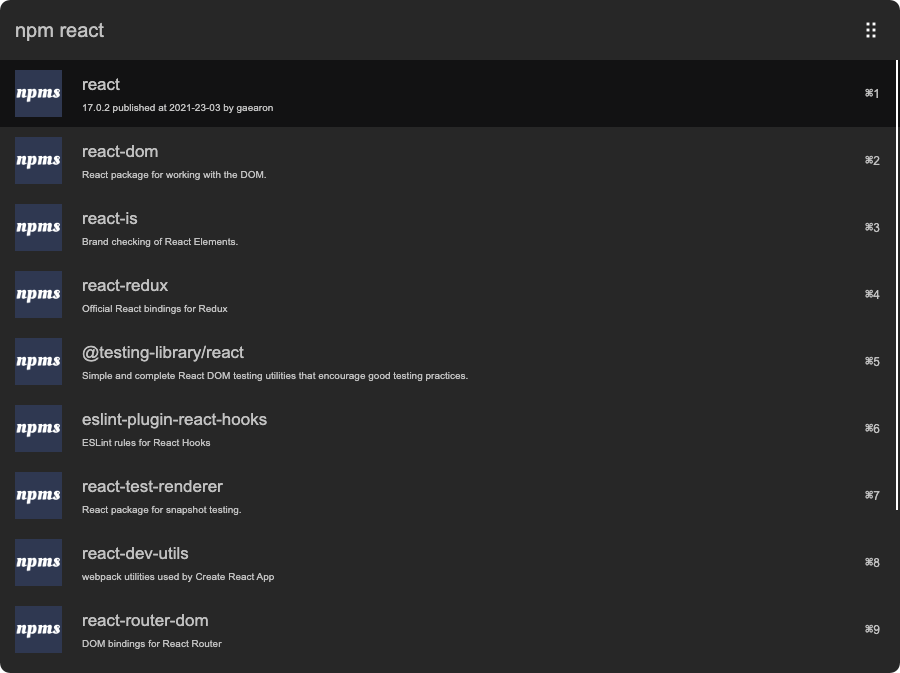
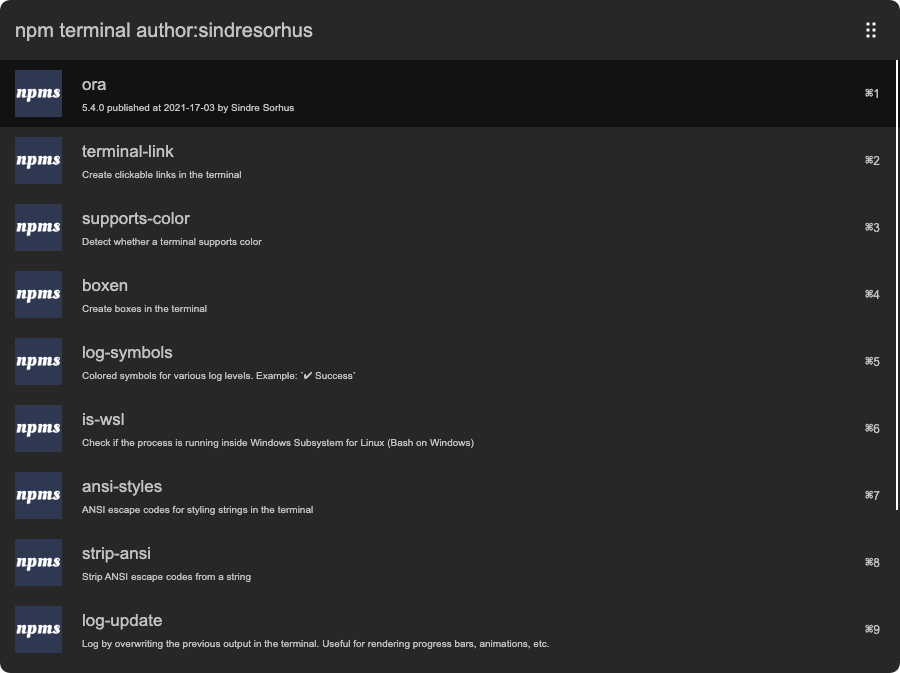

# arvis-npms

> [Arvis](https://github.com/jopemachine/arvis) workflow to search for npm packages with [npms.io](https://npms.io)

npms.io is a great npm package search with deep analysis of package quality using a myriad of metrics. Much better than the official npmjs.com search.



## Install

```
$ npm install --global arvis-npms
```

*Requires [Node.js](https://nodejs.org) 8+*

## Usage

In Arvis, type `npm`, <kbd>Enter</kbd>, and your query, to search for packages.

Select a package and press <kbd>Enter</kbd> to go to its GitHub repo.<br>
Hold <kbd>Alt</kbd> when pressing <kbd>Enter</kbd> to go to its npm page.<br>
Hold <kbd>Ctrl</kbd> when pressing <kbd>Enter</kbd> to copy the package name to the clipboard.<br>
Press <kbd>Command</kbd> to display additional information.<br>
Press <kbd>Shift</kbd> to view its readme in Quick Look.

The search is made with `boost-exact:false` by default. You may pass any npms.io [operators](https://api-docs.npms.io/#api-search-query).



